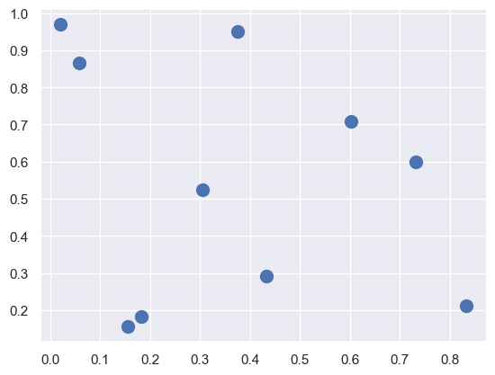

## Numpy 

참고문헌

[numpy 공식 홈페이지](https://numpy.org/)

[데이터 사이언스 스쿨](https://datascienceschool.net/01%20python/03.00%203%EC%9E%A5%20%EB%84%98%ED%8C%8C%EC%9D%B4%20%EB%B0%B0%EC%97%B4%20%ED%94%84%EB%A1%9C%EA%B7%B8%EB%9E%98%EB%B0%8D.html#)

NumPy 는 과학연산에 활용되는 패키지이다. 다양한 기능을 제공하는데 다차원 array 오브젝트, 빠르고 강력한 배열 연산, shape 조작, 정렬, 선형대수, 통계, 시뮬레이션등 다양하게 횔용된다. 

- NumPy arrays have a **fixed size** at creation, unlike Python lists (which can grow dynamically). Changing the size of an *ndarray* will create a new array and delete the original.
- <u>The elements in a NumPy</u> array are all required to be of the **same data type**, and thus will be the **same size** in memory. The exception: one can have arrays of (Python, including NumPy) objects, thereby allowing for arrays of different sized elements.
- NumPy 배열은 대용량 데이터에 대한 수학적인 연산과 기타 연산을 용이하게 한다. 이러한 작업들은 파이썬에서 빌트인으로 제공하는 시퀀스(리스트,튜플)보다 훨씬 효율적으로 작동한다. 
- A growing plethora of scientific and **mathematical Python-based packages** are using NumPy arrays.
- 추가) **pandas의 데이터의 구조가 numpy를 기본**으로 만들어졌기 때문에 numpy를 이해해야 pandas를 이해할 수 있다.
- NumPy forms the basis of powerful machine learning libraries like [scikit-learn](https://scikit-learn.org/) and [SciPy](https://www.scipy.org/). As machine learning grows, so does the list of libraries built on NumPy. [TensorFlow’s](https://www.tensorflow.org/) deep learning capabilities have broad applications — among them speech and image recognition, text-based applications, time-series analysis, and video detection. [PyTorch](https://pytorch.org/), another deep learning library, is popular among researchers in computer vision and natural language processing. [MXNet](https://github.com/apache/incubator-mxnet) is another AI package, providing blueprints and templates for deep learning.


###  예제

```python
>>> import numpy as np
>>> a = np.arange(15).reshape(3, 5)
>>> a
array([[ 0,  1,  2,  3,  4],
       [ 5,  6,  7,  8,  9],
       [10, 11, 12, 13, 14]])
>>> a.shape
(3, 5)
>>> a.ndim
2
>>> a.dtype.name
'int64'
>>> a.itemsize
8
>>> a.size
15
>>> type(a)
<class 'numpy.ndarray'>
>>> b = np.array([6, 7, 8])
>>> b
array([6, 7, 8])
>>> type(b)
<class 'numpy.ndarray'>
```


## 1. 넘파이 배열

### 1.1 다차원 배열

넘파이 배열은 type(ar)로 살펴보면 numpy.ndarray라는 구조를 가짐.     

list와 비슷하지만 다르다. 행렬 연산 효율성을 위해 모든 자료형이 같아야 한다는 제약이 있다.

#### 1차원 배열

```python
ar = np.array([0,1,2,3,4,5,6,7,8,9])
ar 
----------------------------------------
array([0,1,2,3,4,5,6,7,8,9])
```

#### 2차원 배열

```python
ar = np.array([[0,1,2][3,4,5]])
ar
----------------------------------------
array([[1, 2, 3],
       [4, 5, 6]])
```


### 1.2 배열의 차원과 크기

배열의 차원은 ndim,  배열의 크기는 shape 를 통해 구한다    

```python
c = np.array([[0, 1, 2], [3, 4, 5]])
print(c.ndim)
print(c.shape)
------------------------------------------
2
(2,3)
```

### 1.3 인덱싱

배열의 인덱싱은 1차원은 리스트와 같지만, 다차원 배열은 comma를 사용하여 접근할 수 있다. 물론 list 방식으로도 접근이 가능하다.

```python
c = np.array([[0, 1, 2], [3, 4, 5]])
c[0,1] #c[0][1] 도 가능하다. 첫번째행 두번째 열
----------------------------------------
1
```

### 1.4 슬라이싱

```python
c = np.array([[0, 1, 2], [3, 4, 5]])
c[:,1] # 모든행 2열
----------------------------------------
array([1,4])
```

```python
c[1,1:] # 2행 2열부터 끝열까지
----------------------------------------
array([4,5])
```

### 1.5 백터화 연산

백터의 같은 인덱스에 위치한 원소들끼리 연산을 수행하는 기능으로서 반복문을 사용하지 않고 연산을 수행하는 방법이다.  이 방법은 반복문보다 속도가 빠르다.  

``` python
data = [1,2,3,4,5]
```

####  스칼라곱 연산

모든 원소에 2를 곱한 결과를 얻으려면?

```python
data*2
----------------------------
[1,2,3,4,5,1,2,3,4,5]
```

```python
answer = []
for item in data:
    answer.append(2*item)
answer
---------------------------
[2,2,2,2]
```

벡터화 연산을 활용하면?

```
x = np.array(data)
x*2
----------------------
array([2,2,2,2])
```

#### 비교연산

``` python
x = np.array(data)
data == 1
---------------------------
array([ True, False, False, False, False])
```

```python
x = np.array(data)
data > 2
---------------------------
array([ False, False, True, True, True])
```

### 1.6 배열 인덱싱

####  Boolean 배열 인덱싱

특정 조건을 만족하는 요소만 추출할 때 사용한다. 

```python
a = np.array([0,1,2,3,4,5,6,7,8,9])
idx = a > 7
a[idx]
----------------------------------------
array([8,9])
```

 연습문제: 짝수이면 출력하시오

```python
a = np.array([0,1,2,3,4,5,6,7,8,9])
idx = a % 2 == 0
a[idx]
----------------------------------------
array([0,2,4,6,8])
```

#### 정수 배열 방식

```python
a = np.array([11, 22, 33, 44, 55, 66, 77, 88, 99])
idx = np.array([0, 2, 4, 6, 8])
a[idx]
---------------------------------------
array([11, 33, 55, 77, 99])
```


## 2.  배열의 생성과 변형

### 2.1 넘파이의 자료형 지정

넘파이의 원소는 모두 같은 자료여야 한다. 자료형을 명시적으로 지정하려면 dytpe 인수를 활용한다. 자료형을 지정하지 않으면 스스로 유추해서 대입한다.

```python
x = np.array([1,2,3], dtype='f')
x.dtype
----------------------------------
dtype('float32')
```

```python
x = np.array([1, 2, 3], dtype='u8') # 부호 없는 정수
x.dtype
--------------------------------
dtype('uint64')
```

| dtype 접두사 | 설명            | 사용 예                  |
| ------------ | --------------- | ------------------------ |
| `b`          | 불리언          | `b` (참 혹은 거짓)       |
| `i`          | 정수            | `i8` (64비트)            |
| `u`          | 부호 없는 정수  | `u8` (64비트)            |
| `f`          | 부동소수점      | `f8` (64비트)            |
| `c`          | 복소 부동소수점 | `c16` (128비트)          |
| `O`          | 객체            | `0` (객체에 대한 포인터) |
| `S`          | 바이트 문자열   | `S24` (24 글자)          |
| `U`          | 유니코드 문자열 | `U24` (24 유니코드 글자) |

### 2.2 배열 생성

#### zeros

```python
a = np.zeros(5)
a
--------------------
array([0., 0., 0., 0., 0.])
```

```python
b = np.zeros((2,3))
b
-----------------------
array([[0., 0., 0.],
       [0., 0., 0.]])
```

```python
c = np.zeros((5,2), dtype='i')
c
--------------------------------
array([[0, 0],
       [0, 0],
       [0, 0],
       [0, 0],
       [0, 0]], dtype=int32)
```

#### ones

```python
e = np.ones((2,3,4), dtype ='i8') #2면 3행 4열 이라고 읽는다.
e
-------------------------------------
array([[[1, 1, 1, 1],
        [1, 1, 1, 1],
        [1, 1, 1, 1]],

       [[1, 1, 1, 1],
        [1, 1, 1, 1],
        [1, 1, 1, 1]]])
```

#### like

```python
f = np.ones_like(b, dtype='f') #zeros_like도 사용이 가능하다.
f
-----------------------------------
array([[1., 1., 1.],
       [1., 1., 1.]], dtype=float32)
```

####  empty

배열의 초기화를 하지 않고 garbage로 생성한다.

```python
g = np.empty((4, 3))
g
-----------------------------
array([[6.94820328e-310, 4.67533915e-310, 5.28964691e+180],
       [6.01346953e-154, 4.81809028e+233, 7.86517465e+276],
       [6.01346953e-154, 2.58408173e+161, 2.46600381e-154],
       [2.47379808e-091, 4.47593816e-091, 6.01347002e-154]])
```

#### arange

numpy 버전의  range라고 생각하면 된다.

```python
np.arange(10)
--------------------
array([0, 1, 2, 3, 4, 5, 6, 7, 8, 9])
```

```python
np.arange(3,21,2)
------------------------------------
array([ 3,  5,  7,  9, 11, 13, 15, 17, 19])
```

#### linespace, logspace

```python
np.linespace(0,100,5)
-------------------------------------
array([  0.,  25.,  50.,  75., 100.])
```

```python
np.logspace(0.1, 1, 10) #log10(x1)=0.1 ~ log10(x2)=1
-------------------------------------
array([ 1.25892541,  1.58489319,  1.99526231,  2.51188643,  3.16227766,
        3.98107171,  5.01187234,  6.30957344,  7.94328235, 10.        ])
```

### 2.3 배열의 크기 변형

#### reshape

```python
a = np.arrange(12)
a.reshape(3,4)
-----------------------------
array([[ 0,  1,  2,  3],
       [ 4,  5,  6,  7],
       [ 8,  9, 10, 11]])
```

```python
a.reshape(3,-1)
-----------------------------
array([[ 0,  1,  2,  3],
       [ 4,  5,  6,  7],
       [ 8,  9, 10, 11]])
```

```python
a.reshape(2,2,-1)               #2면 2행 3열 array 생성
-----------------------------
array([[[ 0,  1,  2],
        [ 3,  4,  5]],

       [[ 6,  7,  8],
        [ 9, 10, 11]]])
```

```python
a.reshape(2, -1, 2)
```

#### flatten

배열을 1차원으로 변경

```python
a = np.arrange(12)
a = a.reshape(3,4)
a.flatten()
-----------------------------
array([ 0,  1,  2,  3,  4,  5,  6,  7,  8,  9, 10, 11])
```

#### newaxis

차원을 증가시키고자 하는 경우

```python
x = np.array([1,2,3])
x[:, np.newaxis]
--------------------------------------------
array([[1],
       [2],
       [3]])
```


## 3. 배열의 연산

### 3.1 백터화 연산

백터화 연산을 쓰면 반복문을 쓰지 않고도 배열의 모든 원소에 대해 반복 연산이 된다.

```python
x = np.array([1,2,3,4])
y = np.array([4,2,2,4])
z = np.array([1,2,3,4])
```

```python
x+y
----------------------------
array([5, 4, 5, 8])
```

```python
x==y
--------------------------
array([False,  True, False,  True])
```

```python
np.all(x==y)
---------------------------
False

np.all(x==z)
----------------------------
True
```

```python
np.exp(x)
----------------------------
array([ 2.71828183,  7.3890561 , 20.08553692, 54.59815003])
```

```python
10**x
-----------------------------
array([   10,   100,  1000, 10000], dtype=int32)
```

### 3.2 브로드캐스팅

넘파이에서 행렬 또는 벡터가 덧셈 또는 뺄셈 연산을 하려면 두 벡터(행렬)의 크기가 같아야 한다. 그런데 서로 크기가 다르면 어떻게 처리할까?    

넘파이에서는 브로드캐스팅 연산을 통해 크기가 작은 행렬(벡터)을 크기가 큰 행렬에 자동으로 맞춘뒤에 연산을 수행한다. 

``` python
x = np.arrage(5)
x + 1
------------------------
array([1,2,3,4,5])
```

```python
x = np.array([[1,2,3],[4,5,6]]) # 2행 3열
y = np.array([[1,1,1]])# 1행 3열  --> 2행 3열로 변환함
x+y
-----------------------------------------------
array([[2, 3, 4],
       [5, 6, 7]])
```


#### 브로드 캐스팅 규칙

규칙1.  두 배열의 차원수가 다르면 더 작은 차원을 가진 배열의 앞쪽을 1로 채운다. 

규칙2.  두 배열의 shape가 다르면 1인 부분을 다른 shape와 맞추도록 늘린다

규칙3. 1,2를 적용해도 shape가 다르면 오류가 발생한다. 


#### 브로드캐스팅 예제

```python
#브로드캐스팅 예제 1
M=np.ones((2,3))
a=np.arange(3)

print(M) # (2,3)
print(a) # (3,) => (1,3) => (2,3)
M+a 
```

```python
#브로드캐스팅 예제 2
a = np.arange(3).reshape((3,1))
b = np.arange(3) 

a #(3,1) ==> (3,3) 
b #(3,) => (1,3)==>(3,3)
a+b # 
```

```python
#브로드캐스팅 예제3
M = np.ones((3,2))
a = np.arange(3)

M+a # 에러 발생한다. 왜냐면 a =>(3,) ==> (1,3) ==> (2,3) 으로 변경되고 M=>(3,1)과 shape이 다르다.
# 이문제를 풀고 싶다면, 
a[:, np.newaxis] # ==> 축을 새로 만들어준다. (3,1) ==> (3,2) 로 차원이 맞춰지게 된다. 
```


### 3.3 통계량

```python
x = np.array([1,2,3,4])
```

```python
np.sum(x)
x.sum()
```

```python
x.min()
x.max()
x.argmin() # 최솟값의 위치
x.argmax() # 최댓값의 위치
x.mean()
x.median()
```

```python
np.all([True, True, False])
-------------------------------
False

np.any([True, True, False])
-------------------------------
True
```

```python
x = np.array([[1, 1], [2, 2]])
x.sum(axis = 0) #열의 합계를 구함 array([3,3])
x.sum(axis = 1) #행의 합계를 구함 array([2,4])
```


### 3.4 정렬과 탐색

#### 정렬

정렬된 배열을 반환하며, 퀵정렬 알고리즘을 사용하여, List를 정렬하는 알고리즘보다 numpy의 알고리즘이 빠르다.

```python
x = np.array([2,1,4,3,5])
np.sort(x)
---------------------
array([1,2,3,4,5])
```

#### 정렬된 인덱스 반환

정렬된 배열을 반환하는 것이 아니라 그 정렬한 뒤의 아이템에 해당하는 인덱스를 반환한다. 

```python
x = np.array([2,1,4,3,5])
i = np.argsort(x)
print(i)
---------------------
[1 0 3 2 4]

x[i]
---------------------
array([1,2,3,4,5])
```


#### 축에 따라 정렬하기

```python
rand = np.random.RandomState(42)
X = rand.randint(0,10,(4,6))
np.sort(X, axis=0) 
```


#### 이진탐색

이미 정렬이 되어 있는 배열을 대상으로 탐색할때 이진탐색을 이용하면 계산 효율을 높일 수 있다. 어떤 데이터가 x로 나누어진 구간에 몇번째에 있는지 알 수 있다. 

```python
#x는 미리 정렬이 되어 있어야 됨
#0까지는 0번째 index
#13까지는 1번째 index
#26까지는 2번째 index
#30까지는 3번째 index
x=np.array([0., 13., 26., 30.]) 
np.searchsorted(x, 5.0) # 1 
np.searchsorted(x,13.0) # 1
np.searchsorted(x,13.0, side='right') #2 
################################################
#배열에 대해서 탐색
np.searchsorted(x,[5.0, 13.0])
```


### 3.5 인덱싱 연산

#### np.add.at(A,idx,B)

A배열의 idx 위치에 B를 더한다. 

```python
#x배열의 1,3,5,7 위치에 1을 더한다
import numpy as np 
x = np.zeros(10)
i=[1,3,5,7]
np.add.at(x, i, 1)
print(x) ## ==> array([1., 1., 1., 0., 0., 0., 0., 0., 0., 0.])
```


## 4. 연습 문제

* 다음 배열을 중앙(평균)으로 Centering 해 보시오

  ```python
  X=np.random.random((10,3))
  Xmean = X.mean(0) # 평균
  ```

  

* 다음식을 2차원상에서 시각화 해 보세요

  x, y는 0~5까지 0.1단위로 linspace를 이용하고,  그림은 imshow를 이용한다.

  ```python
  z = np.sin(x)**10 + np.cos(10+y*x)*np.cos(x)
  ```

  

* 다음 데이터에 대해서 통계량을 구하시오

  ```python
  # 다음은 Seattle 2014년 강수량 데이터이다. 물음에 답하시오
  csv_path = 'http://raw.githubusercontent.com/jakevdp/PythonDataScienceHandbook/master/notebooks/data/Seattle2014.csv'
  rainfall = pd.read_csv(csv_path)['PRCP'].values
  inches = rainfall / 254 
  
  #1. 비가오지 않은 날은 총 몇일인가?
  #2. 비가 온 날은 총 몇일인가?
  #3. 0.5 인치보다 크고, 1인치보다 작은 강수량은 총 몇일인가?
  ```

  ```python
  # 비가 온 날과 여름은 다음과 같이 정의할 수 있다. 
  # 이를 이용하여 다음 문제에 답하시오!
  rainy = (inches > 0)
  summer = ((np.arange(365) -172 < 90)) & ((np.arange(365) -172) > 0)
  
  #1. 비가 온 날의 강수량 평균?
  #2. 여름 강수량의 평균은?
  #3. 여름에 최대 강수량은?
  #4. 여름이외의 계절에 비가 온날의 강수량 평균은?
  ```

  

* 다음 데이터에 대해서 아래 조건을 활용하여 히스토그램을 그려 보시오 

  * np.searchsorted 함수를 활용
  * np.add.at 함수를 활용
  * bins를 -5~5사이로 50칸 만든 다음에 
  * x가 위의 bins 중에서 어느 칸에 속하는지 파악을 하고 
  * 해당하는 칸에 몇개가 있는지 np.add.at을 이용하여 카운트한다.

  ```python
  np.random.seed(42)
  x=np.random.randn(100) # 정규분포로 100개의 난수를 생성한다.
  ```

  

* 아래의 점들에 대해서 최근접한 이웃점들을 구하고 도식화 하는 알고리즘을 개발하시오

  ```python
  import numpy as np
  import matplotlib.pyplot as plt
  import seaborn
  
  rand=np.random.RandomState(42)
  X= rand.rand(10,2)
  seaborn.set()
  plt.scatter(X[:,0], X[:,1], s=100)
  ```

  

  

  

  hint: 아래와 같이 하면 각 점들간의 차이 좌표를 구할 수 있다. 

  ```python
  x1=X[:,np.newaxis,:]
  x2=X[np.newaxis,:,:]
  difference = x1-x2
  difference.shape # (10,10,2)
  ```

  


### Todo

* Numpy를 이용한 최근접 이웃 알고리즘 추가 
* Numpy의 구조화된 배열 추가 --> pandas와 자연스럽게 연결되도록 하기 
